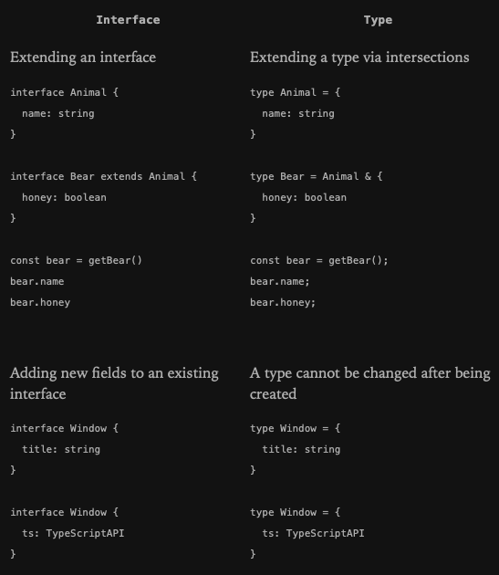

# Everyday Types

### The primitives: string, number and boolean

JS has three very commonly used **primitives**: `string`, `number`, and `boolean`. Each has a corresponding type in TS.
As expected, these are the same names you'd see if you used the JS `typeof` operator on a value of those types.

> The type names **String**, **Number**, and **Boolean** are legal, but refer to some special built-in types that will
> very rarely appear in your code. _Always_ use the lowercased variant of the 3 types mentioned.


### Arrays

To specify the type of an array like [1, 2, 3], you can use the syntax `number[]`; this syntax works for any type (e.g. 
string[] is an array of strings, and so on). You may also see this written as `Array<number>`, which means the same thing.


### any

TS also has a special type, `any`, that you can use whenever you don't wat a particular value to cause a typechecking errors.

When a value is of type `any`, you can access any properties of it (which will in turn be of type `any`), call it like a
function, assign it to (or from) a value of any type, or pretty much anything else that is syntactically legal:

```typescript
let obj: any = { x: 0 };
```

The `any` type is useful when you don't want to write a long type just to convince TS that a particular line of code is okay.


#### noImplicitAny

When you don't specify a type, and TS can't infer it from the context, the compiler will typically default to `any`. 
You usually want to avoid this, though, because any isn't type-checked. 


### Type Annotations and Variables

When you declare a variable using `const`, `var`, or `let`, you can optionally add a type annotation to explicitly
specify the type of the variable:

```typescript
let myName: string = "Alice";
```

In most cases, though, this isn't needed. Wherever possible, TS tries to automatically _infer_ the types in your code. 
For example, the type of a variable is inferred based on the type of its initializer.

```typescript
// No type annotation needed – 'myName' inferred as type 'string'
let myName = "Alice";
```

For the most part you don't need to explicitly learn the rules of the inference. If you are starting out, try using fewer 
type annotations than you think – you might be surprised by how few you need for TS to fully understand what's going on.


## Functions

### Parameter Type Annotations

Parameter type annotations go after the parameter name:

```typescript
function greet(name: string) {
  console.log(`My name is ${name}`);
}
```


### Return type Annotations

Return type annotations appear after the parameter list:

```typescript
function getFavoriteNumber(): number {
  return 26;
}
```

Much like variable type annotations, you usually don't need a return type annotation because TS will infer the function's
return type based on its `return` statements. The type annotation in the above example doesn't change anything. Some 
codebases will explicitly specify a return type for documentation purposes, to prevent accidental changes, or just for
personal preference.


### Anonymous functions

Anonymous functions are a little bit different from function declarations. When a function appears in a place where TS
can determine how it's going to be called, the parameters of that function are automatically given types.

The process of inferring the type of a function is from the _context_ where it occurred within is called _contextual typing_.

Similar to the interface rules, you don't need to explicitly learn how this happens, but understanding that it _does_ can
help you notice when type annotations aren't needed. 


### Object Types

Apart from primitives, the most common sort of type you'll encounter is an _object type_. This refers to any JS value with
properties, which is almost all of them! To define an object type, we simply list its properties and their types.

```typescript
function printCoord(pt: { x: number, y: number }) {
  // ...
}
```

You can use `,` or `;` to separate the properties, and the last separator is optional either way. The type part of each
property is also optional. If you don't specify a type, it will be assumed to be `any`.


#### Optional properties

Object types can also specify that some or all of their properties are _optional_. To do this, add a `?` after the 
property name:

```typescript
function printName(obj: { first: string; last?: string }) {
  // ...
}
```

In JS, if you access a property that doesn't exist, you'll get the value `undefined` rather than a runtime error. Because
of this, when you _read_ from an optional property, you'll have to check for `undefined` before using it.


## Union Types

TS's type system allows you to build new types out of existing ones using a large variety of operators. 


### Defining a Union Type

The first way to combine types you might see is a _union_ type. A union type is a type formed from two or more other 
types, representing values that may be _any one_ of those types. We refer to each of these types as the union's _members_.

```typescript
const printId = (id: number | string) => "Your ID is: " + id;
```


### Working with Union Types

TS will only allow you to do things with the union if that thing is valid for _every_ member of the union. For example, if
you have the union `string | number`, you can't use methods that are only available on string:

```typescript
const printId = (id: number | string) => console.log(id.toUpperCase());

// Property 'toUpperCase' does not exist on type 'string | number'.
// Property 'toUpperCase' does not exist on type 'number'.
```

The solution is to _narrow_ the union with code, the same as you would in JS without type annotations. _Narrowing_ occurs
when TS can deduce a more specific type for a value based on the structure of the code (duck typing).

For example, TS knows that only a string value will have a typeof value "string":

```typescript
const printId = (id: number | string) => {
  if (typeof id === "string") {
    // ... handle id as a string
  } else {
    // ... handle id as a number 
  }
}
```

When you have a union where all the members have a property in common, you can use that property without narrowing.

> It might be confusing that a _union_ of types appears to have the _intersection_ of those types' props. This is not an
> accident – the name _union_ comes from type theory. The _union_ `number | string` is composed by taking the union of the
> _values_ from each type. 


## Type Aliases

A _type alias_ is a _name_ for any _type_.

```typescript
type Point = {
  x: number;
  y: number;
}

const printCoord = (pt: Point) => print(pt.x, pt.y) 
```

You can use a type alias to give a name to any type at all, not just an object type.

```typescript
type ID = number | string;
```

## Interfaces

An _interface declaration_ is another way to name an object type:

```typescript
interface Point {
  x: number;
  y: number;
}

const printCoord = (pt: Point) => console.log(pt.x, pt.y)
```

TS is only concerned with the _structure_ of the value passed to `printCoord` – it only cares that it has the expected props.
Being concerned only with the structure and capabilities of types is why we call TS a _structurally typed_ type system.


### Differences Between Type Aliases and Interfaces

They are very similar, and in many cases you can choose between them freely. Almost all features of an **interface** are
available in **type**, the key distinction is that a type cannon be reopened to add new properties vs an interface which
is always extendable.



- Prior to TS 4.2 type alias names may appear in error messages, sometimes in place of the equivalent anonymous type.
  Interfaces will always be named in error messages.
- Type aliases may not participate in declaration merging, but interfaces can.
- Interfaces may only be used to declare the shapes of objects, not rename primitives.
- Interfaces names will always appear in their original form in error messages, but only when they are used by name.


## Type Assertions

Sometimes you will have info about the type of value that TS can't know about.

For example, if you are using `document.getElementById`, TS only knows that this will return _some_ kind of **HTMLElement**,
but you might know that your page will always have an **HTMLCanvasElement** with a given ID.

In this situation, you can use _type assertion_ to specify a more specific type:

```typescript
const myCanvas = document.getElementById("main_canvas") as HTMLCanvasElement;
```

Like type annotation, type assertions are removed by the compiler and won't affect the runtime behavior of your code.

You can also use the angle-bracket syntax (except if the code is in a `.tsx` file), which is equivalent:

```typescript
const myCanvas = <HTMLCanvasElement>document.getElementById("main_canvas");
```

> Because type assertions are removed at compile time, there is no runtime checking associated with a type assertion.
> There won't be an exception or `null` generated if the type assertion is wrong.

TS only allows type assertions which convert to a _more specific_ or _less specific_ version of a type. This rule prevents
"impossible" coercions.

```typescript
const x = "hello" as number;

// Exception: Conversion of type 'string' to type 'number' may be a mistake because neither type sufficiently overlaps with
//            the other. If this was intentional, convert the expression to 'unknown' first.
```

Sometimes this rule can be too conservative. In such case you can use two assertions, first to **any** (or **unknown**),
then to the desired type:

```typescript
const a = (expr as any) as T;
```


## Literal Types

```typescript
let changingString = "Hello World";
changingString = "Ola Mundo";
// Because 'changingString' can represent any possible string, that is how
// TS describes it in the type system
//
// let changingString: string

const constantString = "Hello World";
// Because 'constantString' can only represent 1 possible string, it has a 
// literal type representation
//
// const constantString: "Hello World"
```

By themselves, literal types aren't very valuable:

```typescript
let x: "hello" = "hello";
x = "howdy"

// Type '"howdy"' is not assignable tot type '"hello"'.
```

But by _combining_ literals into unions, you can express a much more useful concept – for example, functions that only
accept a certain set of known values.

```typescript
const printText = (s: string, alignment: "left" | "right" | "center") => {}
```


### Literal Inference

When you initialize a variable with an object, TS assumes that the props of that object might change values later.

```typescript
const obj = { counter: 0 };
if (someCondition) {
  obj.counter = 1;
}
```

TS doesn't assume the assignment of 1 to a field which previously had 0 is an error. Another way of saying this is that
`obj.counter` must have the type **number**, not 0, because types are used to determine both _reading_ and _writing_
behavior.

The same applies to strings:

```typescript
const req = { url: "https://example.com", method: "GET" };
handleRequest(req.url, req.method)

// Argument of type 'string' is not assignable to parameter of type '"GET" | "POST'.
```

In the above example `req.method` is inferred to be **string**, not "GET". Because code can be evaluated between the
creation of req and the call of `handleRequest` which could assign a new string like "GUESS" to `req.method`, TS considers
this code to have an error.

Two ways to work around this.

1. You can change the inference by adding a type assertion in either location
    ```typescript
    // Change 1
    const req = { url: "https://example.com", method: "GET" as "GET" };
    // Change 2
    handleReq(req.url, req.method as "GET");
    ```
2. You can use `const` to convert the entire object to be type literals
    ```typescript
    const req = { url: "https://example.com", method: "GET" } as const;
    handleRequest(req.url, req.method)
    ```
   
The `as const` suffix acts like `const` but for the type system, ensuring that all properties are assigned the literal 
type of a more general version like **string** or **number**.


